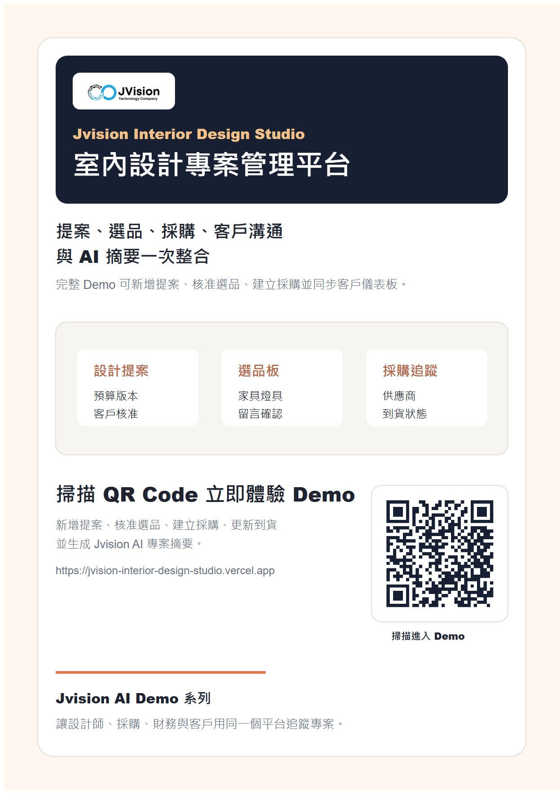

# Jvision 室內設計專案管理平台

Jvision 室內設計專案管理平台是一個獨立互動 Demo，將提案、選品板、商品資料庫、採購追蹤、客戶儀表板與 AI 摘要集中在同一個設計工作台。

## 線上 Demo

https://jvision-interior-design-studio.vercel.app



## Demo 功能

- 新增室內設計提案與預算
- 核准或替換選品板項目
- 從選品建立採購追蹤
- 更新下單、運送與到貨狀態
- 查看客戶儀表板紀錄
- 生成 Jvision AI 專案摘要

## 指令

```bash
npm install
npm run assets
npm run build
npm run verify
```

## 行銷素材

- `docs/marketing/jvision-interior-design-studio-poster.png`
- `docs/marketing/jvision-interior-design-studio-poster.pdf`
- `docs/marketing/jvision-interior-design-studio-product-introduction.pdf`
